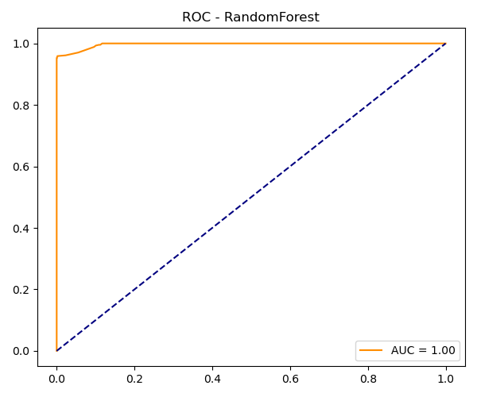
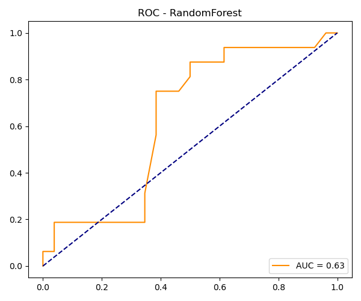

# 🧠 ENDES Big Data & Machine Learning

Modelos predictivos construidos sobre los microdatos de la **Encuesta Demográfica y de Salud Familiar (ENDES – INEI)** para identificar **riesgo en el embarazo** y **violencia familiar**. El proyecto cubre el flujo completo: ETL distribuido con **PySpark**, entrenamiento y evaluación de modelos y una **API REST** para hacer predicciones.


## 🎯 Objetivos

| Modelo | Variable objetivo | Fuentes ENDES |
|:--|:--|:--|
| **Riesgo en el embarazo** | Controles prenatales insuficientes (< 4) o parto fuera de un establecimiento de salud | REC41, REC94, RE516171 |
| **Violencia familiar** | Presencia de violencia doméstica reportada | REC84DV, RE516171 |

## ⚙️ Flujo del proyecto

```
data/raw (CSV ENDES)
   │
   ▼
src/etl_procesamiento.py   →  limpieza, normalización de IDs y cruce de módulos (PySpark)
   │
   ▼
src/train_modelos.py       →  balanceo de clases, entrenamiento y evaluación
   │                           (Regresión Logística · Random Forest · Gradient Boosting)
   ▼
outputs/                   →  matrices de confusión, curvas ROC y tabla de resultados
   │
   ▼
src/api.py                 →  API REST (FastAPI) que sirve los modelos entrenados
```

## 📁 Estructura

```
endes-bigdata-ml/
├── notebooks/            # Exploración de datos (EDA)
├── src/
│   ├── etl_procesamiento.py
│   ├── train_modelos.py
│   └── api.py
├── outputs/
│   ├── figures/          # Matrices de confusión y curvas ROC por modelo
│   └── tables/
├── Dockerfile            # Imagen jupyter/pyspark-notebook + dependencias
├── docker-compose.yml    # Hadoop (namenode + datanode) + entorno Spark
└── requirements.txt
```

## 🚀 Cómo ejecutarlo

> Los datos crudos de ENDES no se incluyen en el repositorio. Descárgalos del portal de microdatos del INEI y colócalos en `data/raw/`.

```bash
# 1. Levantar el entorno (Hadoop + Spark + Jupyter)
docker compose up -d --build

# 2. Ejecutar el ETL y el entrenamiento dentro del contenedor
docker exec -it endes_ml_container spark-submit src/etl_procesamiento.py
docker exec -it endes_ml_container spark-submit src/train_modelos.py

# 3. Iniciar la API
docker exec -it endes_ml_container spark-submit src/api.py
```

- JupyterLab: http://localhost:8888
- Spark UI: http://localhost:4040
- Documentación de la API: http://localhost:8000/docs

## 📊 Resultados

Ejemplos de evaluación (Random Forest):

| Riesgo en el embarazo | Violencia familiar |
|:--:|:--:|
|  |  |

Todas las matrices de confusión y curvas ROC están en [`outputs/figures`](outputs/figures).

## 👤 Autor

**Rafael Roncal Saravia**: [LinkedIn](https://www.linkedin.com/in/rafael-roncal-saravia) · [GitHub](https://github.com/Rafa-rs4)
